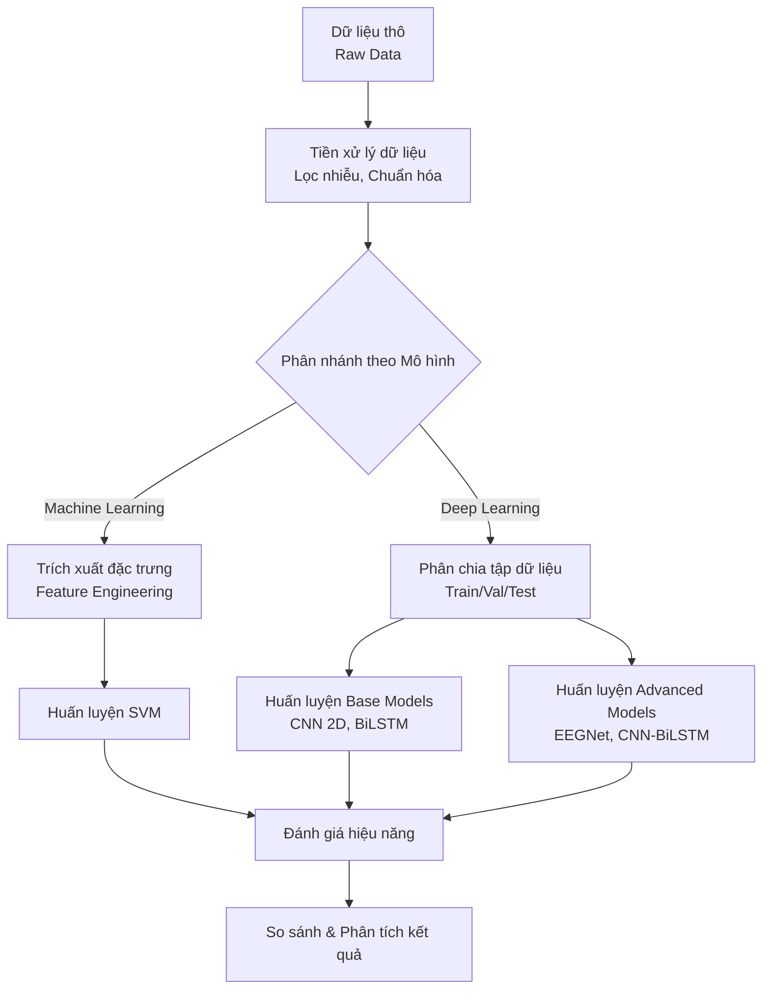
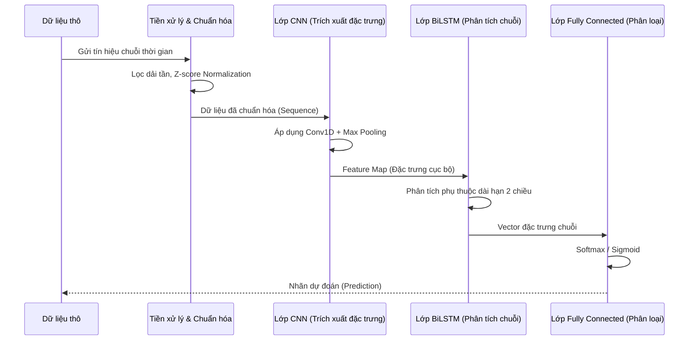

# 🧠 Báo cáo Bài tập lớn Học máy — Phân tích và Phân loại dữ liệu tín hiệu

> **Dự án nghiên cứu, tiền xử lý dữ liệu và đánh giá hiệu năng của các mô hình học máy (SVM) và học sâu (CNN 2D, BiLSTM, EEGNet) trên tập dữ liệu chuỗi thời gian/tín hiệu sinh học.**
> 
> **Môn học:** Học máy ML-2526II_INT3405
> **Trường:** Đại học Công nghệ, ĐHQGHN  

| Tên | MSSV | Vai trò chính |
|-----|------|---------------|
| Nguyễn Đức Long | 24022391 | Tìm kiếm bài báo khoa học, xây dựng mô hình CNN 2D và cải tiến bằng mô hình EEGNet chuyên biệt. |
| Phạm Thái Dương | 24022307 | Tiền xử lí dữ liệu đầu vào, xây dựng mô hình BiLSTM và cải tiến bằng kiến trúc lai CNN-BiLSTM. |
| Nguyễn Tiến Dũng | 24022301 | Làm mô hình phân loại SVM, trích xuất và cải tiến các đặc trưng (features) cho SVM, hỗ trợ cải tiến mô hình. |

[](https://www.python.org/)
[](https://pytorch.org/)
[](https://scikit-learn.org/)
[](https://jupyter.org/)

---

## Mục lục

- [1. Giới thiệu](#1-giới-thiệu)
- [2. Kiến trúc & Pipeline mô hình](#2-kiến-trúc--pipeline-mô-hình)
  - [2.1 Sơ đồ Pipeline tổng quan](#21-sơ-đồ-pipeline-tổng-quan)
  - [2.2 Bảng mô tả các phương pháp](#22-bảng-mô-tả-các-phương-pháp)
- [3. Tech Stack & Thư viện](#3-tech-stack--thư-viện)
- [4. Yêu cầu hệ thống](#4-yêu-cầu-hệ-thống)
- [5. Hướng dẫn cài đặt & chạy](#5-hướng-dẫn-cài-đặt--chạy)
- [6. Cấu trúc dữ liệu đầu vào](#6-cấu-trúc-dữ-liệu-đầu-vào)
- [7. Chi tiết các mô hình](#7-chi-tiết-các-mô-hình)
- [8. Đánh giá hiệu năng](#8-đánh-giá-hiệu-năng)
- [9. Kết luận & Định hướng phát triển](#9-kết-luận--định-hướng-phát-triển)
- [10. Tham khảo (References)](#10-tham-khảo-references)
- [11. Cấu trúc thư mục](#11-cấu-trúc-thư-mục)
- [12. Hướng dẫn đóng góp (Contributing)](#12-hướng-dẫn-đóng-góp-contributing)

---

## 1. Giới thiệu

Dự án này tập trung vào việc phân tích, xử lý và phân loại các tín hiệu sinh học (chuỗi thời gian) nhằm trích xuất các thông tin hữu ích và nhận dạng các mẫu hình đặc trưng. Mục tiêu chính là so sánh hiệu năng của các thuật toán Học máy truyền thống (điển hình là SVM) với các kiến trúc Học sâu tiên tiến (CNN 2D, BiLSTM).

Việc áp dụng các mô hình học sâu chuyên biệt như **EEGNet** hay kiến trúc lai **CNN-BiLSTM** mang lại ưu thế lớn so với SVM truyền thống:
- **Khả năng trích xuất đặc trưng tự động**: Tránh sự phụ thuộc quá nhiều vào Feature Engineering thủ công như trong SVM.
- **Khai thác quan hệ không gian - thời gian**: CNN trích xuất tốt đặc trưng không gian (spatial features), trong khi BiLSTM xử lý mạnh mẽ các phụ thuộc dài hạn trong chuỗi thời gian (temporal features).
- **Khả năng tổng quát hóa cao**: Các kiến trúc như EEGNet được thiết kế đặc thù cho tín hiệu não/tín hiệu sinh lý học, giúp mô hình hoạt động ổn định và chính xác trên các bộ dữ liệu nhiễu cao.

---

## 2. Kiến trúc & Pipeline mô hình

### 2.1 Sơ đồ Pipeline tổng quan



### 2.2 Bảng mô tả các phương pháp

| Phương pháp / Mô hình | Loại mô hình | Mục đích & Đặc điểm |
|-----------------------|--------------|---------------------|
| **SVM** | Học máy truyền thống | Phân loại dựa trên tập đặc trưng (features) đã được trích xuất và chọn lọc thủ công. Phù hợp làm baseline. |
| **CNN 2D** | Học sâu | Biến đổi tín hiệu 1D thành biểu diễn 2D, dùng tích chập để tự động trích xuất các đặc trưng cục bộ. |
| **BiLSTM** | Học sâu | Khai thác thông tin chuỗi thời gian hai chiều (quá khứ và tương lai) để dự đoán hiệu quả chuỗi tín hiệu dài. |
| **CNN-BiLSTM** | Học sâu (Lai) | Kết hợp CNN (trích xuất đặc trưng không gian) và BiLSTM (mô hình hóa phụ thuộc thời gian), tăng tính mạnh mẽ. |
| **EEGNet** | Học sâu (Chuyên biệt)| Kiến trúc CNN tinh gọn, thiết kế đặc thù cho tín hiệu sinh lý học (EEG), giảm thiểu số lượng tham số nhưng tối đa độ chính xác. |

---

## 3. Tech Stack & Thư viện

| Thư viện / Công cụ | Phiên bản | Mục đích sử dụng |
|--------------------|-----------|------------------|
| **Python** | `3.10+` | Ngôn ngữ lập trình cốt lõi của dự án. |
| **PyTorch** | `>=2.0` | Xây dựng và huấn luyện các mô hình Học sâu (CNN, BiLSTM, EEGNet). |
| **Scikit-learn** | `>=1.3` | Trích xuất đặc trưng, xây dựng mô hình SVM, tính toán các metrics đánh giá. |
| **NumPy & SciPy** | `>=1.24`, `>=1.10`| Đọc, xử lý toán học, tính toán ma trận dữ liệu và thao tác chuỗi thời gian. |
| **Matplotlib / Seaborn** | `>=3.7`, `>=0.12`| Trực quan hóa dữ liệu, vẽ biểu đồ học (Learning Curve), Confusion Matrix. |
| **Kagglehub** | `[pandas-datasets]` | Hỗ trợ tải dữ liệu từ Kaggle nhanh chóng. |
| **tqdm** | `Latest` | Hiển thị thanh tiến trình (progress bar) trong quá trình huấn luyện. |

---

## 4. Yêu cầu hệ thống

| Thành phần | Yêu cầu (Local) | Yêu cầu (Cloud - Khuyến nghị) |
|------------|-----------------|-------------------------------|
| **Môi trường** | Jupyter Notebook / VS Code | Google Colab / Kaggle Notebook |
| **Hệ điều hành**| Windows / Linux / macOS | Linux (Ubuntu) |
| **CPU** | Intel Core i5 / AMD Ryzen 5 trở lên | Standard CPU (Colab) |
| **RAM** | Tối thiểu 8 GB (Khuyến nghị 16 GB)| 12 GB+ |
| **GPU** | NVIDIA GPU (hỗ trợ CUDA) | **T4 GPU** (bắt buộc để train DL nhanh)|

---

## 5. Hướng dẫn cài đặt & chạy

**Bước 1: Clone repository**
```bash
git clone https://github.com/phamthaiduongcode/ML-2526II_INT3405-_3-The-Trinity
cd  ML-2526II_INT3405-_3-The-Trinity  
```

**Bước 2: Cài đặt môi trường và các thư viện cần thiết**
```bash
# Cài đặt qua requirements.txt
pip install -r requirements.txt
```

**Bước 3: Chuẩn bị dữ liệu**
- Đặt các file dữ liệu gốc vào thư mục `data/raw/` (Xem mục 6 để biết cấu trúc) hoắc sử dụng lệnh 
```bash
python src/data_pipeline/load_raw.py
``` 
để tải dữ liệu.
- Chạy script tiền xử lý (nếu chạy dưới dạng file python):
```bash
python src/data_pipeline/preprocess.py
```

**Bước 4: Chạy huấn luyện và đánh giá mô hình**
Dự án được tổ chức thành các mã nguồn độc lập theo từng mô hình trong thư mục `experiments/`. Bạn có thể chạy trực tiếp các kịch bản thử nghiệm:
- **SVM**: Chạy các script trong `experiments/svm/` (ví dụ: `python -m experiments.svm.svm_exp1_2class`).
- **CNN / EEGNet**: Chạy các script trong `experiments/cnn/` (ví dụ: `python -m experiments.cnn.train_engine` hoặc các file `train_eegnet*.py`).
- **BiLSTM / Lai**: Chạy các script trong `experiments/bilstm/` (ví dụ: `python -m experiments.bilstm.exp1_2class`).
*(Lưu ý: Đối với các mô hình Học sâu, khuyến khích chạy trên máy có GPU hoặc Google Colab để tăng tốc độ huấn luyện)*.

---

## 6. Cấu trúc dữ liệu đầu vào

Hệ thống yêu cầu tập dữ liệu tín hiệu sinh lý hoặc chuỗi thời gian. Định dạng chuẩn được lưu trong thư mục `data/`.

- **Định dạng file:** Dữ liệu có thể ở định dạng CSV (`.csv`), numpy array (`.npy`), hoặc định dạng tín hiệu đặc thù (như `.edf`, `.mat`).
- **Cấu trúc dữ liệu:**
  - `X`: Ma trận đặc trưng hoặc chuỗi thời gian có dạng `(số_lượng_mẫu, số_bước_thời_gian, số_kênh_tín_hiệu)`.
  - `y`: Nhãn phân loại dạng vector `(số_lượng_mẫu,)`.
- **Thư mục phân chia:**
  - `data/raw/`: Dữ liệu gốc chưa xử lý.
  - `data/processed/`: Dữ liệu đã qua lọc nhiễu, chuẩn hóa (Z-score/Min-Max) và sẵn sàng để train. Cắt thành các tập `train`, `val`, `test`.

---

## 7. Chi tiết các mô hình

- **SVM (Support Vector Machine):** Phân loại dữ liệu dựa trên việc tìm siêu phẳng tối ưu. Đòi hỏi việc trích xuất các đặc trưng thống kê (mean, variance, skewness...), tần số (PSD) từ tín hiệu thô.
- **CNN 2D:** Áp dụng biến đổi tín hiệu 1D sang dạng ảnh 2D (ví dụ: Spectrogram) để áp dụng tích chập, giúp mạng tự động học các đặc trưng không gian, tần số.
- **BiLSTM:** Bi-directional Long Short-Term Memory giúp ghi nhớ thông tin theo cả 2 chiều thời gian, rất hiệu quả với tín hiệu tuần tự.
- **EEGNet:** Một cấu trúc mạng CNN chuyên dụng, sử dụng Depthwise và Separable Convolution để giảm thiểu số lượng tham số trong khi vẫn giữ khả năng trích xuất các đặc trưng theo thời gian và không gian một cách xuất sắc.

### Luồng xử lý cho mô hình lai CNN-BiLSTM



---

## 8. Đánh giá hiệu năng

Dưới đây là tổng hợp kết quả của các mô hình trên 3 kịch bản thực nghiệm chính:

### 8.1. Exp 1 — Phân loại nhị phân (Subject-Dependent, 5-Fold CV)
Kết quả trung bình qua 5 fold trên bài toán phân loại Valence và Arousal.

| Mô hình | Nhãn | Accuracy | Precision | Recall | F1-macro |
|---------|------|----------|-----------|--------|----------|
| **SVM** | Valence | 0.5479 ± 0.0613 | 0.5130 ± 0.0540 | 0.5131 ± 0.0549 | 0.4989 ± 0.0541 |
| | Arousal | 0.5667 ± 0.0684 | 0.5287 ± 0.0612 | 0.5289 ± 0.0623 | 0.5173 ± 0.0620 |
| **CNN 2D** | Valence | 0.6700 ± 0.0033 | 0.6715 ± 0.0042 | 0.6700 ± 0.0033 | 0.6691 ± 0.0030 |
| | Arousal | - | - | - | - |
| **BiLSTM** | Valence | 0.6573 ± 0.0036 | 0.6580 ± 0.0040 | 0.6575 ± 0.0037 | 0.6571 ± 0.0034 |
| | Arousal | 0.6444 ± 0.0051 | 0.6461 ± 0.0043 | 0.6444 ± 0.0051 | 0.6433 ± 0.0057 |

### 8.2. Exp 2 — Phân loại 4 lớp (Subject-Dependent, 5-Fold CV)

| Mô hình | Accuracy | Precision | Recall | F1-macro |
|---------|----------|-----------|--------|----------|
| **SVM** | 0.3597 ± 0.0815 | 0.2643 ± 0.0505 | 0.2652 ± 0.0505 | 0.2472 ± 0.0454 |
| **CNN 2D** | 0.4815 ± 0.0031 | 0.4773 ± 0.0030 | 0.4747 ± 0.0018 | 0.4701 ± 0.0024 |
| **BiLSTM** | 0.4672 ± 0.0059 | 0.4608 ± 0.0056 | 0.4614 ± 0.0054 | 0.4578 ± 0.0056 |

> **Nhận xét:** Khi chuyển từ bài toán 2 lớp sang 4 lớp, hiệu năng của tất cả các mô hình đều suy giảm rõ rệt. Tuy nhiên, các mô hình Học sâu (CNN 2D, BiLSTM) vẫn giữ được độ chính xác cao hơn hẳn so với thuật toán truyền thống (SVM).

### 8.3. Exp 3 — Leave-One-Subject-Out (LOSO)
Đây là kịch bản thực nghiệm khắt khe nhất, phản ánh khả năng tổng quát hóa thực sự của mô hình khi triển khai trên người dùng mới. Toàn bộ 32 subject được lần lượt trích ra làm tập test, phần còn lại dùng để huấn luyện.

| Mô hình | Nhãn | Accuracy | Precision | Recall | F1-macro |
|---------|------|----------|-----------|--------|----------|
| **SVM** | Valence | 0.5208 ± 0.0450 | 0.5206 ± 0.0443 | 0.5235 ± 0.0479 | 0.5106 ± 0.0437 |
| | Arousal | 0.5056 ± 0.0729 | 0.5053 ± 0.0709 | 0.5034 ± 0.0764 | 0.4935 ± 0.0772 |
| **CNN 2D** | Valence | 0.5973 ± 0.0979 | 0.5376 ± 0.0826 | 0.5401 ± 0.0407 | 0.5235 ± 0.0673 |
| | Arousal | - | - | - | - |
| **BiLSTM** | Valence | 0.5514 ± 0.0612 | - | - | 0.5020 ± 0.0367 |
| | Arousal | 0.5456 ± 0.0572 | - | - | 0.5025 ± 0.0292 |

---

## 9. Kết luận & Định hướng phát triển

**Kết luận thực nghiệm:**
Báo cáo này trình bày một hệ thống phân loại cảm xúc từ tín hiệu EEG trên bộ dữ liệu DEAP, được triển khai theo chiến lược hai giai đoạn có cấu trúc rõ ràng và quy trình đánh giá kiểm soát chặt chẽ.

- **Giai đoạn 1 (Fair Benchmark):** Thiết lập khung so sánh công bằng giữa ba mô hình đơn lẻ — SVM, CNN 2D và BiLSTM — trên cùng một data pipeline. Kết quả cho thấy CNN 2D đạt F1-macro 0.669 ở kịch bản Subject-Dependent (Exp 1) và 0.524 ở LOSO (Exp 3); BiLSTM đạt lần lượt 0.657 và 0.502. Đáng chú ý, SVM với đặc trưng miền tần số thủ công (PSD, DE, Asymmetry) tuy có F1-macro thấp hơn ở Exp 1 (0.499) nhưng lại **ổn định hơn trong kịch bản LOSO (0.511)**, cho thấy feature engineering giải quyết hiệu quả vấn đề SNR thấp và biến thiên cá thể mà DL end-to-end chưa vượt qua được trên tập dữ liệu nhỏ. Quan sát này xác nhận giả thuyết cốt lõi của nhóm: các mô hình DL end-to-end không thất bại vì kiến trúc yếu, mà vì ba điều kiện tiên quyết chưa được đáp ứng — dữ liệu chưa đủ sạch, tập huấn luyện chưa đủ lớn, và chưa có cơ chế xử lý biến thiên cá thể. 

- **Giai đoạn 2 (Đề xuất cải tiến):** Đề xuất hai hướng cải tiến bổ trợ: 
  1. Thay thế biên độ sóng thô bằng đặc trưng miền tần số (PSD, DE, Asymmetry) để giảm ảnh hưởng của artifact và SNR thấp.
  2. Xây dựng kiến trúc lai **CNN-BiLSTM Dual-Branch Fusion** kết hợp DGCNN (học tương quan không gian điện cực động) và BiLSTM (nắm bắt diễn biến thời gian tần số). Áp dụng **EEGNet** chuyên biệt với Depthwise Convolution và SE Block giúp giảm số tham số xuống còn vài nghìn (phù hợp với quy mô của DEAP) và được cá nhân hóa thông qua chiến lược fine-tuning hai pha.

**Định hướng phát triển:**
- Áp dụng **Euclidean Alignment** toàn pipeline để chuẩn hóa phân phối tín hiệu giữa các subject trước khi huấn luyện.
- Khai thác thêm topology điện cực chuẩn 10-20 vào cấu trúc đồ thị của DGCNN.
- Mở rộng thực nghiệm sang các bộ dữ liệu khác như SEED và MAHNOB-HCI để đánh giá khả năng tổng quát hóa của kiến trúc đề xuất.

---

## 10. Tham khảo (References)

1. R.-N. Duan, J.-Y. Zhu, and B.-L. Lu, “Differential entropy feature for EEG-based emotion classification,” in *2013 6th International IEEE/EMBS Conference on Neural Engineering (NER)*, pp. 81–84, 2013.
2. S. Koelstra, et al., “DEAP: A database for emotion analysis using physiological signals,” *IEEE Transactions on Affective Computing*, vol. 3, no. 1, pp. 18–31, 2012.
3. J. A. Russell, “A circumplex model of affect,” *Journal of Personality and Social Psychology*, vol. 39, no. 6, pp. 1161–1178, 1980.
4. X.-W. Wang, D. Nie, and B.-L. Lu, “Emotional state classification from EEG data using machine learning approach,” *Neurocomputing*, vol. 129, pp. 94–106, 2014.
5. V. J. Lawhern, et al., “EEGNet: a compact convolutional neural network for EEG-based brain–computer interfaces,” *Journal of Neural Engineering*, vol. 15, no. 5, p. 056013, 2018.

---

## 11. Cấu trúc thư mục

```text
├── data/
│   ├── raw/                ← Dữ liệu tín hiệu gốc (định dạng .edf, .csv...)
│   └── processed/          ← Dữ liệu đã qua lọc nhiễu, chuẩn hóa, chia tập train/val/test
├── experiments/            ← Các kịch bản thử nghiệm và huấn luyện cho từng loại mô hình
│   ├── bilstm/             
│   │   ├── exp1_2class.py      ← Phân loại 2 lớp (Valence/Arousal)
│   │   ├── exp2_4class.py      ← Phân loại 4 lớp cảm xúc
│   │   ├── exp3_loso.py        ← Thực nghiệm Leave-One-Subject-Out (LOSO)
│   │   ├── exp4_loso_fusion.py ← Thử nghiệm kiến trúc lai CNN-BiLSTM (Fusion)
│   │   └── run_tsne.py         ← Vẽ biểu đồ t-SNE trực quan hóa đặc trưng
│   ├── cnn/                
│   │   ├── train_engine.py             ← Script cấu hình và luồng huấn luyện chính
│   │   ├── train_EEGNet_fine-tuning.py ← Kịch bản Fine-tuning chuyên biệt cho EEGNet
│   │   └── trainexp1.py, trainexp2.py..← Các script thử nghiệm CNN/EEGNet theo kịch bản
│   └── svm/                
│       ├── svm_exp1_2class.py  ← Đánh giá SVM phân loại 2 lớp
│       ├── svm_exp2_4class.py  ← Đánh giá SVM phân loại 4 lớp
│       ├── svm_exp3_loso.py    ← Đánh giá SVM trên kịch bản LOSO
│       └── svm_utils.py        ← Các hàm tiện ích trích xuất và visualize riêng cho SVM
├── models/                 ← Thư mục ở root level (hiện dùng để chứa cache)
├── src/
│   ├── data_pipeline/      
│   │   ├── load_raw.py         ← Tải dữ liệu thô
│   │   ├── preprocess.py       ← Tiền xử lý cơ bản
│   │   ├── preprocesspro.py    ← Tiền xử lý nâng cao
│   │   ├── feature_extractor.py← Class trích xuất đặc trưng
│   │   └── feature_extraction.py
│   ├── models/             
│   │   ├── cnn.py              ← Kiến trúc CNN 2D
│   │   ├── cnn2d_bilstm_fusion.py ← Kiến trúc lai CNN-BiLSTM
│   │   ├── eeg_bilstm.py       ← Kiến trúc BiLSTM
│   │   └── eegnet.py           ← Kiến trúc EEGNet
│   └── utils/              ← Các hàm tính metric, vẽ biểu đồ hỗ trợ
├── utils/                  ← Thư mục tiện ích ở root level (hiện chứa cache)
├── result/
│   └── svm/                ← Lưu trữ kết quả thực nghiệm của SVM
│       ├── logs/           ← Log kết quả metrics (JSON), danh sách features (TXT)
│       └── plots/          ← Biểu đồ Confusion Matrix, đường ROC...
├── requirements.txt        ← Danh sách thư viện cần thiết
└── README.md               ← File thông tin dự án
```

---

## 12. Hướng dẫn đóng góp (Contributing)

Nếu bạn muốn đóng góp cải thiện hiệu năng cho các mô hình trong dự án này:
1. **Fork** repository này về tài khoản của bạn.
2. Tạo một branch mới cho tính năng/mô hình của bạn: `git checkout -b feature/model-name`.
3. Cài đặt môi trường qua `requirements.txt` và đảm bảo mã nguồn tuân thủ PEP-8.
4. Push các thay đổi lên: `git push origin feature/model-name`.
5. Tạo một **Pull Request** mô tả chi tiết phương pháp tiếp cận và kết quả cải thiện (benchmark lại với bảng kết quả).

